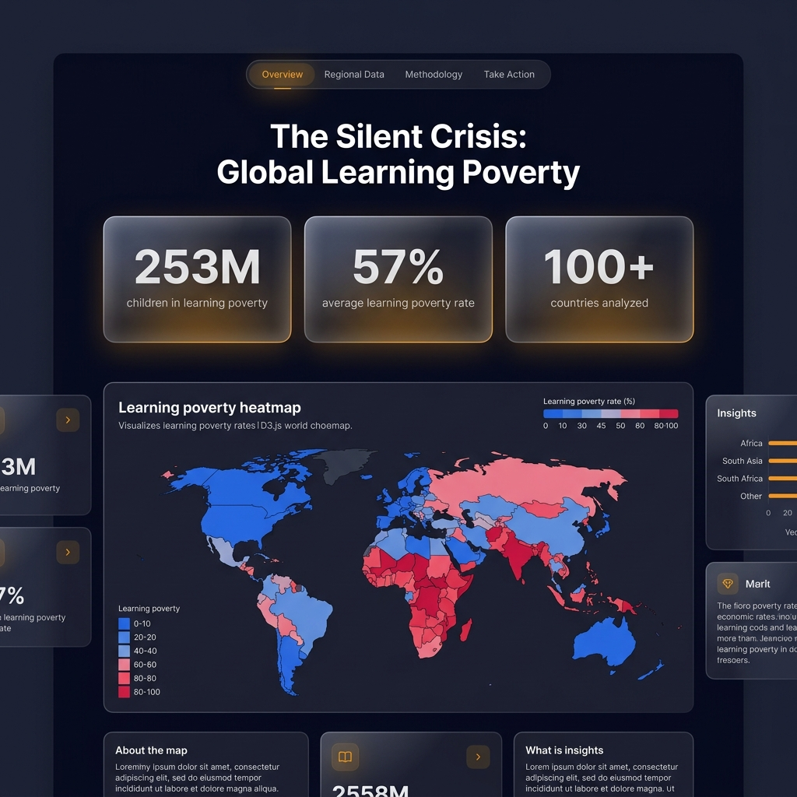
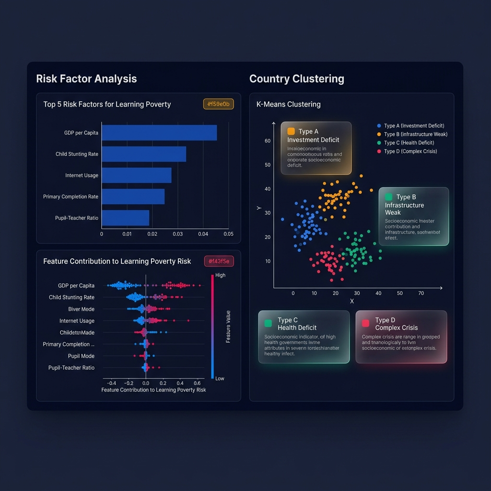
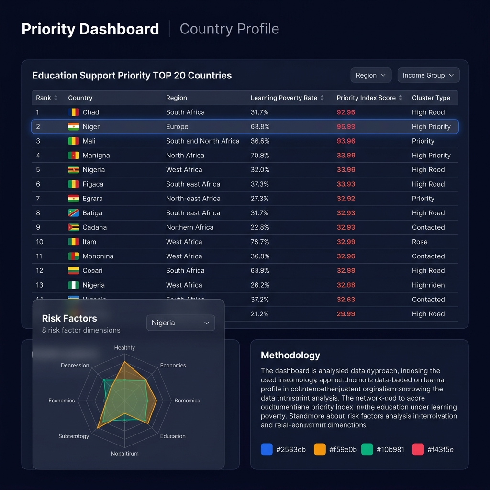

# 프로젝트 기술 스펙 문서
# The Silent Crisis: 글로벌 학습 빈곤 진단 및 교육 지원 전략 수립

| 항목 | 내용 |
| :--- | :--- |
| 프로젝트명 | The Silent Crisis |
| 버전 | v1.0 |
| 작성일 | 2025-05-09 |
| 상태 | 기획 완료 · 개발 착수 전 |

---

## 1. 프로젝트 정의

### 1.1 배경
전 세계 초등교육 등록률은 90%를 넘어섰으나, 학교에 다니면서도 10세가 되도록 간단한 글조차 읽지 못하는 아동이 절반을 넘는다. 세계은행(World Bank)은 이 현상을 **학습 빈곤(Learning Poverty)**이라 정의하며, 교육의 양적 확대만으로는 해결할 수 없는 **'조용한 위기(Silent Crisis)'**라 경고한다.

### 1.2 문제 정의
- 교육 접근성(등록률)은 개선되었으나, 학습 품질(읽기 능력)은 정체 또는 악화
- 학습 빈곤의 위험 요인(경제, 보건, 인프라 등)이 국가마다 다르므로, 획일적 지원 전략은 비효율적
- 제한된 교육 원조 자원을 "어디에, 어떤 방식으로" 투입할지에 대한 데이터 기반 근거 부재

### 1.3 핵심 질문 (Research Questions)
| # | 질문 | 분석 방법 |
| :--- | :--- | :--- |
| RQ1 | 학습 빈곤에 가장 큰 영향을 미치는 위험 요인은 무엇인가? | Feature Importance, SHAP |
| RQ2 | 유사한 위험 구조를 가진 국가들을 어떻게 유형화할 수 있는가? | K-Means Clustering |
| RQ3 | 제한된 교육 자원을 어느 국가에 우선 배분해야 하는가? | 복합 우선순위 지수 설계 |

### 1.4 분석 범위
| 항목 | 내용 |
| :--- | :--- |
| 분석 단위 | 국가(Country-level) |
| 대상 기간 | 2001 ~ 2023년 내 **각 국가의 최신 가용 연도(Latest Available Year)** 기준 |
| 대상 국가 | World Bank Learning Poverty 지표 보유국 약 125개국 (단일 시점 크로스섹션 분석) |

---

## 2. 데이터 스펙

### 2.1 데이터 출처

| # | 구분 | 데이터 출처 | URL | 형식 |
| :--- | :--- | :--- | :--- | :--- |
| DS-1 | 학습 빈곤 원본 | World Bank Data Catalog | https://datacatalog.worldbank.org/search/dataset/0038234 | CSV |
| DS-2 | 위험 요인 지표 | World Bank DataBank (WDI) | https://databank.worldbank.org/source/world-development-indicators | CSV |
| DS-3 | 교육 통계 보조 | UNESCO Institute for Statistics | https://data.uis.unesco.org | CSV |

### 2.2 분석 지표 정의서

#### Target Variable (종속변수)

| 지표명 | 코드 | 정의 | 단위 | 출처 |
| :--- | :--- | :--- | :--- | :--- |
| Learning Poverty | `SE.LPV.PRIM` | 초등 졸업 연령 아동 중 최소 읽기 능력 미달 비율 (학교 밖 아동 포함) | % | DS-1 |

#### Feature Variables (독립변수)

| # | 범주 | 지표명 | 코드 | 정의 | 단위 | 출처 |
| :--- | :--- | :--- | :--- | :--- | :--- | :--- |
| F1 | 경제 | GDP per capita (PPP) | `NY.GDP.PCAP.PP.KD` | 구매력 기준 1인당 GDP | USD | DS-2 |
| F2 | 투자 | 정부 교육 지출 비중 | `SE.XPD.TOTL.GD.ZS` | GDP 대비 정부 교육 지출 | % | DS-2 |
| F3 | 교육환경 | 초등 교사 1인당 학생 수 | `SE.PRM.ENRL.TC.ZS` | 교사 1인이 담당하는 학생 수 | 명 | DS-2 |
| F4 | 보건 | 아동 발육 부진율 | `SH.STA.STNT.ZS` | 5세 미만 발육 부진 비율 | % | DS-2 |
| F5 | 디지털 | 인터넷 사용자 비율 | `IT.NET.USER.ZS` | 전체 인구 중 인터넷 사용자 | % | DS-2 |
| F6 | 접근성 | 초등 순등록률 | `SE.PRM.NENR` | 해당 연령 초등학교 등록 비율 | % | DS-2 |
| F7 | 성과 | 초등교육 수료율 | `SE.PRM.CMPT.ZS` | 초등 교육 과정 이수 비율 | % | DS-2 |
| F8 | 형평성 | 성별 격차 지수 (GPI) | `SE.ENR.PRIM.FM.ZS` | 초등교육 남녀 등록 비율 | 비율 | DS-2 |

> **[주의] 다중공선성 및 내생성 위험:** F6(초등 순등록률)과 F7(초등교육 수료율)은 종속변수(학습빈곤율)의 구성 요소인 비재학률(SD)과 기계적 역관계가 있을 수 있습니다. 따라서 모델링 전 VIF(분산팽창지수) 검증을 거쳐 필요시 제거하거나, 결과 해석 시 인과관계가 아닌 기계적 상관관계임을 명시해야 합니다.

#### Context Variables (맥락변수)

| # | 지표명 | 설명 | 용도 |
| :--- | :--- | :--- | :--- |
| C1 | 지역 분류 (Region) | 동아시아, 사하라 이남 아프리카 등 7개 권역 | 그룹 비교, 시각화 |
| C2 | 소득 분류 (Income Group) | 저소득, 중하위소득, 중상위소득, 고소득 | 경제 수준별 비교 |

### 2.3 데이터 전처리 전략

#### 데이터 변환 정책 (Transformation)

- **종속변수 비대칭성 해소**: 탐색적 데이터 분석(EDA) 결과 학습빈곤율이 강한 양의 비대칭(right-skewed) 분포를 보임에 따라, 선형성 가정을 충족하기 위해 **로그 변환(log1p) 또는 Box-Cox 변환**을 적용한 후 모델링 수행.

#### 결측치 처리 정책

| 상황 | 처리 방법 | 근거 |
| :--- | :--- | :--- |
| 과거 데이터 혼재 | 2015년(SDG 채택 원년) 이후 데이터가 존재하는 국가만 분석 대상 포함 | 심각한 시차(Time-lag) 왜곡 방지 및 SDG 체제 이후 비교 |
| 특정 연도만 누락 | LAY (Latest Available Year): 2015~2023년 내 최신값 1개만 사용 | 국제기구 데이터의 불규칙한 수집 주기 대응 |
| 다수 연도 누락 (패턴적) | K-NN Imputation: 지역·소득 그룹이 유사한 국가의 값으로 보정 | 전체 평균보다 정교한 복원 |
| 핵심 지표 대부분 누락 | 분석 대상에서 제외 (70% 이상 존재 국가만 포함) | 분석 신뢰도 확보 |

#### 데이터 검증 체크리스트

- [ ] 국가 코드(ISO-3) 기준 병합 후 중복 레코드 점검
- [ ] 지표별 분포 확인 (히스토그램, 박스플롯)
- [ ] 이상치(Outlier) 탐색 및 원인 조사
- [ ] Imputation 전후 분포 비교 (KDE Plot)
- [ ] 데이터 가용성 히트맵 생성

---

## 3. 분석 스펙

### 3.1 탐색적 데이터 분석 (EDA)

| 분석 항목 | 방법 | 시각화 |
| :--- | :--- | :--- |
| 학습 빈곤 분포 | 지역별/소득별 기술통계 | Box Plot, Violin Plot |
| 변수 간 관계 | Pearson/Spearman 상관계수 | Correlation Heatmap |
| 다중공선성 | VIF (Variance Inflation Factor) | VIF 바 차트 |
| 긍정적 이상치 | GDP 대비 학습 빈곤 잔차 분석 | Scatter Plot (잔차 하이라이트) |

### 3.2 위험 요인 중요도 분석

| 단계 | 방법 | 산출물 |
| :--- | :--- | :--- |
| 1차 스크리닝 | Random Forest Feature Importance | 변수 중요도 순위 Top 8 |
| 2차 해석 | SHAP (SHapley Additive exPlanations) | 변수별 기여도 방향성 (Beeswarm Plot) |
| 변수 검증 | Permutation Importance | 1차 결과와의 일관성 확인 |
| 모델 검증 | 5-Fold Cross Validation 또는 LOOCV | 과적합 방지 및 모델 일반화 성능 평가 |

> **설계 의도:** 제한된 표본(약 125개국)에서의 과적합 위험을 방지하기 위해 교차 검증(CV)을 도입하고, 3중 검증(Ensemble → SHAP → Permutation)으로 결과의 안정성(Robustness)을 확보한다.

### 3.3 국가 유형 분류 (Clustering)

| 항목 | 내용 |
| :--- | :--- |
| 알고리즘 | K-Means (1차) + Hierarchical Clustering (교차 검증) |
| 입력 데이터 | Feature Variables F1~F8 (표준화 후) |
| 최적 K 결정 | Elbow Method + Silhouette Score |
| 클러스터 프로파일링 | 클러스터별 지표 평균 비교 → 유형 명명 |

**예상 클러스터 유형 (가설):**

| 유형 | 특성 (예상) | 정책 방향 (예상) |
| :--- | :--- | :--- |
| A. 투자 부족형 | 경제력은 있으나 교육 지출 비중이 낮음 | 교육 예산 확대 권고 |
| B. 인프라 취약형 | 교사 부족, 디지털 인프라 미비 | 교원 양성 및 ICT 인프라 지원 |
| C. 보건 결핍형 | 아동 영양 부족이 학습 능력에 직접 영향 | 학교 급식·보건 프로그램 우선 |
| D. 복합 위기형 | 모든 지표가 열악 | 다부문(Multi-sector) 통합 지원 |

### 3.4 교육 지원 우선순위 지수

```
Priority Index = w₁ × (학습 빈곤 심각도) + w₂ × (개선 잠재력) + w₃ × (자원 효율성)
```

| 구성 요소 | 정의 | 산출 방법 |
| :--- | :--- | :--- |
| 학습 빈곤 심각도 | 학습결핍 아동 내 불평등 및 비재학 해소 노력 | WB 제공 원본 지표 직접 활용 (`SE.LPV.PRIM.LPSEV`) |
| 개선 잠재력 | 최소 능력 달성 및 재학 확대에 필요한 평균 노력 | WB 제공 원본 지표 직접 활용 (`SE.LPV.PRIM.LPGAP`) |
| 자원 효율성 | 투입 대비 기대 효과 | SHAP 기반 한계 기여도 |

---

## 4. 웹 어플리케이션 스펙

### 4.1 기술 스택

| 구분 | 기술 | 선정 사유 |
| :--- | :--- | :--- |
| 마크업/스타일 | HTML5 / CSS3 (Vanilla) | 외부 의존성 최소화, GitHub Pages 배포 용이 |
| 로직 | JavaScript (ES6+) | 프레임워크 없이 경량화 |
| 시각화 | Chart.js + D3.js (지도) | Chart.js: 일반 차트 / D3.js: GeoJSON 기반 세계 지도 |
| 데이터 | 정적 JSON (`dashboard_data.json`) | API 서버 불필요, 정적 사이트 배포 가능 |
| 배포 | GitHub Pages | 무료, URL 공유로 즉시 시연 가능 |
| 폰트 | Google Fonts (Inter) | 가독성 높은 모던 산세리프 |

### 4.2 최종 결과물 예시 (Mockup)

> 아래 이미지는 프로젝트 완성 시 예상되는 웹 대시보드의 가상 목업입니다.

#### 🖥️ Hero 섹션 & 글로벌 히트맵

핵심 수치 카드(학습 빈곤 아동 수, 평균 학습 빈곤율, 분석 대상 국가 수)와 D3.js 기반 세계 지도 히트맵을 보여주는 메인 화면입니다.



#### 📊 위험 요인 분석 & 국가 유형 분류

좌측에는 학습 빈곤에 영향을 미치는 Top 5 위험 요인과 SHAP 기여도 시각화, 우측에는 K-Means 클러스터링 결과와 4가지 국가 유형 카드를 보여줍니다.



#### 🎯 우선순위 대시보드 & 국가 프로파일

교육 지원 시급성 TOP 20 국가 테이블(지역·소득 그룹 필터 포함), 선택 국가의 8개 위험 요인 레이더 차트, 분석 방법론 요약 섹션입니다.



---

### 4.3 페이지 구조 및 UI 컴포넌트

```
[싱글 페이지 앱 - 스크롤 기반 Data Journey]

┌─────────────────────────────────────────┐
│  1. Hero Section                        │
│  "학교에 다녀도 배우지 못하는 아이들"    │
│  핵심 수치 카드 3개 (애니메이션 카운터)  │
│  - 학습 빈곤 아동 수                    │
│  - 평균 학습 빈곤율                     │
│  - 분석 대상 국가 수                    │
├─────────────────────────────────────────┤
│  2. Global Heatmap                      │
│  D3.js 기반 세계 지도                   │
│  - 색상 강도: 학습 빈곤율               │
│  - 마우스 호버: 국가명 + 수치 툴팁      │
│  - 클릭: Country Profile 팝업 연결      │
├─────────────────────────────────────────┤
│  3. Country Profile (모달/패널)         │
│  - 레이더 차트: 8개 위험 요인 시각화    │
│  - 소속 클러스터 유형 뱃지              │
│  - 우선순위 지수 점수                   │
├─────────────────────────────────────────┤
│  4. Risk Factor Analysis                │
│  - 위험 요인 Top 5 수평 바 차트         │
│  - SHAP 기반 기여도 방향 시각화         │
├─────────────────────────────────────────┤
│  5. Cluster Map                         │
│  - 클러스터별 국가 그룹 시각화          │
│  - 각 유형별 특성 요약 카드             │
├─────────────────────────────────────────┤
│  6. Priority Dashboard                  │
│  - 지원 시급성 TOP 20 국가 테이블       │
│  - 필터: 지역별, 소득 그룹별            │
│  - 정렬: 우선순위 지수 기준             │
├─────────────────────────────────────────┤
│  7. Methodology & Limitations           │
│  - 분석 방법론 요약                     │
│  - 데이터 출처 및 한계점 명시           │
│  - "상관관계 ≠ 인과관계" 고지          │
└─────────────────────────────────────────┘
```

### 4.4 디자인 시스템

| 요소 | 스펙 |
| :--- | :--- |
| 컬러 모드 | 다크 모드 기본 (배경: `#0a0a1a`) |
| Primary Color | Deep Blue (`#2563eb`) |
| Accent Color | Amber (`#f59e0b`) — 경고/위험 강조 |
| Success Color | Emerald (`#10b981`) — 긍정적 지표 |
| Danger Color | Rose (`#f43f5e`) — 심각한 학습 빈곤 |
| 카드 스타일 | Glassmorphism (반투명 배경 + 블러) |
| 애니메이션 | 스크롤 트리거 fade-in, 숫자 카운트업 |
| 반응형 | 모바일 (< 768px) / 데스크탑 (≥ 768px) |

### 4.5 데이터 흐름

```
[Python 분석]                    [웹 앱]
     │                              │
     ├── EDA 결과 ──────────────▶ dashboard_data.json
     ├── Feature Importance ────▶      │
     ├── Cluster 결과 ──────────▶      │
     ├── 우선순위 지수 ─────────▶      │
     │                              │
     └── GeoJSON (세계 지도) ───▶ countries.geojson
                                    │
                                    ▼
                              index.html
                              ├── style.css
                              ├── app.js
                              └── charts.js
```

---

## 5. 프로젝트 디렉토리 구조

```
project/
├── project_roadmap.md          # 프로젝트 로드맵
├── project_spec.md             # 기술 스펙 문서 (본 문서)
├── data/
│   ├── raw/                    # 원본 데이터 (CSV)
│   │   ├── learning_poverty.csv
│   │   ├── wdi_indicators.csv
│   │   └── unesco_education.csv
│   ├── processed/              # 전처리 완료 데이터
│   │   └── analysis_ready.csv
│   └── data_dictionary.md      # 데이터 사전
├── notebooks/                  # 분석 노트북
│   ├── 01_data_collection.ipynb
│   ├── 02_preprocessing.ipynb
│   ├── 03_eda.ipynb
│   └── 04_modeling.ipynb
├── scripts/                    # 자동화 스크립트
│   ├── collect_data.py
│   └── generate_dashboard_data.py
├── webapp/                     # 웹 어플리케이션
│   ├── index.html
│   ├── css/
│   │   └── style.css
│   ├── js/
│   │   ├── app.js
│   │   └── charts.js
│   ├── data/
│   │   ├── dashboard_data.json
│   │   └── countries.geojson
│   └── assets/
│       └── fonts/
└── docs/                       # 문서
    ├── analysis_report.md      # 분석 보고서
    └── README.md               # 프로젝트 소개
```

---

## 6. 예상 한계점 (Limitations)

| # | 한계 | 영향 | 완화 전략 |
| :--- | :--- | :--- | :--- |
| L1 | **데이터 시차 (2~4년)** | 현 시점과 실제 상황의 괴리 가능 | LAY 전략 + 시점 명시 |
| L2 | **상관관계 ≠ 인과관계** | 정책 효과를 과대/과소 추정할 위험 | SHAP 해석 시 "연관성"으로 한정, 웹앱에 고지문 삽입 |
| L3 | **결측치 보정의 불확실성** | Imputation 값이 실제와 다를 수 있음 | 보정 비율 투명 공개, 전후 분포 비교 시각화 |
| L4 | **국가 내 격차 미반영** | 도시/농촌, 성별, 소득 계층 간 편차 포착 불가 | 분석 단위의 한계로 명시, 향후 과제로 제안 |
| L5 | **표본 편향** | 데이터 부재 국가가 실제로 가장 취약한 국가일 가능성 | 제외 국가 별도 리스트 제공, "데이터 사각지대" 보고 |

---

## 7. 프로젝트 의의 (Significance)

1. **교육 패러다임 전환:** "학교에 보내는 것"에서 "실제로 배우는가"로의 질적 전환을 데이터로 입증한다.
2. **자원 배분 효율화:** 한정된 국제 원조 자금의 우선순위를 감(感)이 아닌 데이터 기반으로 결정할 근거를 제공한다.
3. **벤치마킹 국가 발굴:** 경제력 대비 학습 빈곤이 낮은 "긍정적 이상치" 국가의 성공 요인을 분석하는 출발점을 마련한다.
4. **실행 가능한 결과물:** 인터랙티브 웹 앱을 통해 비전문가도 데이터를 탐색하고 인사이트를 얻을 수 있게 한다.
5. **분석 역량 증명:** 문제 정의 → 데이터 수집 → 전처리 → 모델링 → 시각화 → 스토리텔링의 전 과정을 단일 프로젝트에서 보여준다.

---

## 8. 향후 확장 가능성

| 방향 | 내용 |
| :--- | :--- |
| 시계열 예측 | 연도별 데이터를 활용한 학습 빈곤율 변화 추이 예측 (Prophet, ARIMA) |
| 하위 국가 분석 | PISA 등 학생 단위 데이터를 결합하여 국가 내 격차 분석 |
| NLP 연계 | 국제기구 교육 정책 보고서의 키워드 트렌드 분석과 매핑 |
| 실시간 업데이트 | World Bank API 연동을 통한 데이터 자동 갱신 파이프라인 구축 |
