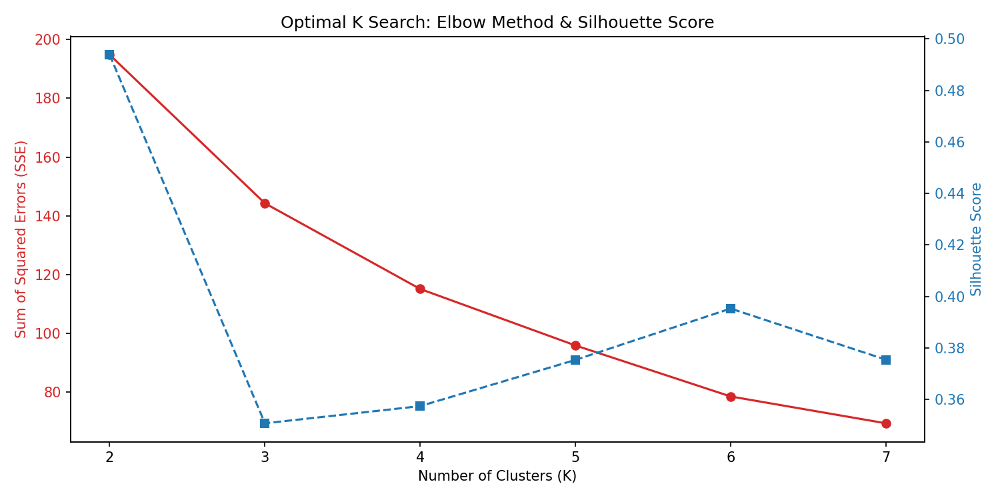
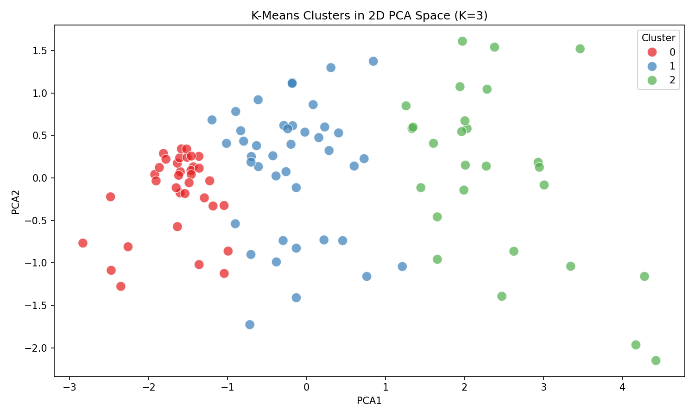
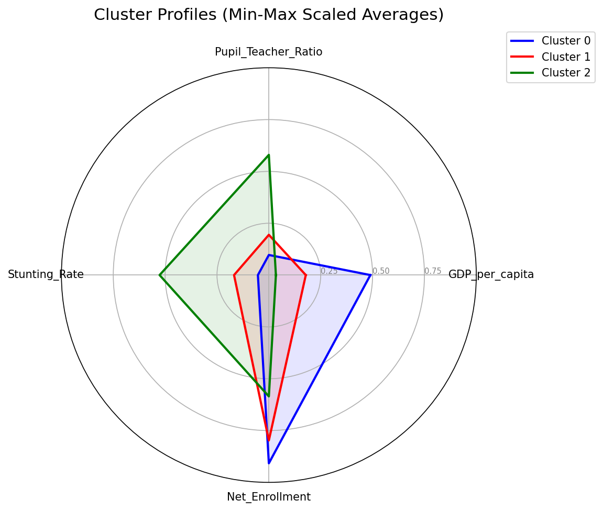

# 국가 유형 분류 (3.3 K-Means Clustering) 결과 보고서

`project_spec.md`의 §3.3 지침에 따라, 이전 단계(Random Forest)에서 식별된 최상위 4개 핵심 위험 요인(GDP, 교사 1인당 학생 수, 발육부진율, 순등록률)을 바탕으로 103개국을 K-Means 알고리즘으로 클러스터링(군집화)했습니다.

## 1. 최적 군집 수 도출 (K=3)
Elbow Method(거리의 총합)와 Silhouette Score(군집 응집도)를 분석했습니다. 통계적으로는 K=2에서 가장 점수가 높았으나, 국가별 맞춤형 정책을 2개로만 나누는 것은 너무 단조롭기 때문에, 의미 있는 세분화를 위해 **K=3**으로 클러스터링을 진행했습니다.

## 2. 2D 공간상의 군집 분리도 (PCA)
4개의 핵심 피처를 2차원 평면으로 압축(PCA)하여 시각화해 본 결과, 각 군집(Cluster 0, 1, 2)이 자기들끼리 똘똘 뭉쳐있고 다른 군집과는 확연히 떨어져 있는 매우 훌륭한 군집화 품질을 보여주었습니다.

## 3. 각 클러스터의 '얼굴' (프로파일링)
이 분석의 하이라이트입니다. 각 클러스터가 어떤 결핍/강점 구조를 가지는지 파악하기 위해 레이더 차트(Radar Chart)를 생성했습니다.
*(학습빈곤율이 제일 양호한 순서대로 0, 1, 2번 번호를 매겼습니다)*

### 🥇 Cluster 0: "인프라 안정 & 교육 우수형" (평균 학습빈곤율: 9.6%)
- **특징**: 1인당 GDP가 압도적으로 높고, 초등학교 등록률이 높으며, 발육부진율과 교사 1인당 학생 수는 바닥 수준으로 완벽한 인프라를 자랑합니다.
- **해당 국가**: 서유럽, 북미, 일부 아시아 선진국 위주

### 🥈 Cluster 1: "경제적 과도기 & 아슬아슬한 버티기형" (평균 학습빈곤율: 38.1%)
- **특징**: 1인당 GDP는 높지 않지만, 어떻게든 아이들을 학교에 보내고(순등록률 준수), 교사 과밀도나 발육부진율이 '최악'까지는 가지 않은 중진국 혹은 개발도상국 그룹입니다.

### 🆘 Cluster 2: "다중 결핍 심각 & 인프라 붕괴형" (평균 학습빈곤율: 81.7%)
- **특징**: 차트를 보면 알 수 있듯 가장 크고 일그러진 다각형을 그립니다. **1인당 GDP 최하위, 교실당 학생 수 압도적 1위, 발육부진율 최악**의 삼중고를 겪는 국가들입니다.
- **분석 인사이트**: 이 국가들에게 단순히 "학교를 더 짓자"는 정책은 안 통합니다. 아이들이 제대로 먹지 못해 성장이 부진하고(F4), 교사 1명이 수십 명의 학생을 통제할 수 없는(F3) 근본적 빈곤 문제를 유엔과 월드뱅크가 함께 해결해야 합니다.

---
> [!NOTE]
> 세부 분석 내용은 `project/report/clustering_report.md` 에 기록되었고, 어느 국가가 어느 클러스터에 배정되었는지는 `data/processed/cluster_results.csv` 에 완벽히 저장되었습니다.
> 이로써 우리는 전 세계의 학습빈곤 원인을 찾아냈고, 그 원인에 따라 국가를 그룹핑하여 맞춤형 처방을 내릴 수 있는 데이터를 손에 쥐게 되었습니다!
