# WB_LPGD (Learning Poverty Global Database) 탐색적 데이터 분석 보고서

> **분석일**: 2026-05-09  
> **데이터 출처**: World Bank - Learning Poverty Global Database  
> **분석 대상**: WB_LPGD.csv (9,329행 × 37열)

---

## 1. 데이터 개요

### 1.1 데이터셋 기본 정보

| 항목 | 값 |
|------|-----|
| 총 레코드 수 | 9,329건 |
| 총 컬럼 수 | 37개 |
| 대상 국가 수 | 125개국 |
| 지표 수 | 9개 |
| 연도 범위 | 2001 ~ 2023년 |
| 결측값 | 없음 (모든 컬럼 결측 0) |
| 중복 레코드 | 없음 |

### 1.2 지표 설명 (JSON 메타데이터 기반)

이 데이터셋은 세계은행의 **학습빈곤 글로벌 데이터베이스(Learning Poverty Global Database)**에서 제공하는 9개 핵심 지표로 구성되어 있다. 각 지표의 상세 설명은 개별 JSON 메타데이터 파일에서 추출하였으며, 지표별 정의와 측정 단위는 다음과 같다:

| 지표 코드 | 지표명 | 단위 | 설명 |
|-----------|--------|------|------|
| SE_LPV_POP | 기준연도(2019) 인구 | Count | 2019년 기준 해당 연령대 인구 수 |
| SE_LPV_POP_PRIM | 초등학령 인구(2019) | Count | 2019년 기준 초등학교 연령 인구 수 |
| SE_LPV_PRIM | 학습빈곤율 | % | 초등 졸업 연령 아동 중 최소 읽기 능력 미달+비재학 비율 |
| SE_LPV_PRIM_LD | 읽기 미달성률 | % | 초등 졸업 시점 최소 읽기 능력 미달 비율 (GAML 기준) |
| SE_LPV_PRIM_LDGAP | 학습결핍 격차 | % | 학습결핍 아동의 최소 능력 수준까지의 평균 거리 |
| SE_LPV_PRIM_LDSEV | 학습결핍 심각도 | % | 학습빈곤 인구 내 학습 불평등 정도 |
| SE_LPV_PRIM_LPGAP | 학습빈곤 격차 | % | 최소 능력 달성 및 재학 확대에 필요한 평균 노력 |
| SE_LPV_PRIM_LPSEV | 학습빈곤 심각도 | % | 학습결핍 아동 내 불평등 및 비재학 해소 노력 |
| SE_LPV_PRIM_SD | 초등 비재학률 | % | 초등학교 연령 비재학 아동 비율 (SDG 4.1.4 연계) |

### 1.3 지표별 데이터 건수

| 지표 | 건수 |
|------|------|
| SE_LPV_POP (인구) | 3,154건 |
| SE_LPV_PRIM (학습빈곤율) | 795건 |
| SE_LPV_PRIM_LD (읽기미달성률) | 795건 |
| SE_LPV_PRIM_SD (비재학률) | 795건 |
| SE_LPV_POP_PRIM (초등학령인구) | 774건 |
| SE_LPV_PRIM_LDGAP (학습결핍격차) | 754건 |
| SE_LPV_PRIM_LDSEV (학습결핍심각도) | 754건 |
| SE_LPV_PRIM_LPGAP (학습빈곤격차) | 754건 |
| SE_LPV_PRIM_LPSEV (학습빈곤심각도) | 754건 |

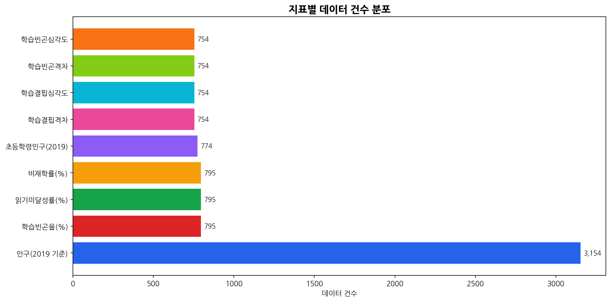

**해석**: 인구 관련 지표(SE_LPV_POP)가 전체 데이터의 약 34%를 차지하며 가장 많은 레코드를 보유하고 있다. 이는 인구 지표가 연령 그룹별(5~16세, 10세, 10~14세 등)로 세분화되어 기록되기 때문이다. 퍼센트 기반의 학습빈곤 관련 7개 지표는 각각 754~795건으로 비교적 균등한 분포를 보인다.

---

## 2. 기술통계 분석

### 2.1 범주형 변수 분석 보고서

본 데이터셋의 범주형 변수를 분석한 결과, 데이터의 구조와 특성에 대해 다음과 같은 핵심적인 인사이트를 도출할 수 있었다. 첫째, **성별(SEX_LABEL)** 변수는 Total(3,781건), Male(2,797건), Female(2,751건)의 세 범주로 구성되어 있으며, Total이 가장 많은 비율을 차지하고 있다. 남녀 성별 데이터는 비교적 균등하게 분포되어 있어, 성별 간 비교 분석이 가능한 구조임을 확인하였다. 둘째, **연령(AGE_LABEL)** 변수는 다양한 연령 그룹을 포함하고 있는데, '연령 구분 없음(All age ranges)'과 '5~16세', '10세', '10~14세' 등 다양한 범주가 존재한다. 이는 인구 지표가 다양한 연령대에 대해 수집된 반면, 학습빈곤 관련 지표는 주로 초등 졸업 연령(약 10세)을 대상으로 한다는 것을 의미한다. 셋째, **도시화(URBANISATION_LABEL)** 변수는 모든 레코드가 'Total'로 기록되어 있어, 현재 데이터셋에서는 도시/농촌 구분 분석이 불가능하다. 넷째, **측정단위(UNIT_MEASURE_LABEL)** 는 Count(3,928건)와 Percentage(5,401건)로 나뉘며, 퍼센트 기반 지표가 전체의 약 58%를 차지하고 있다. 다섯째, 125개국이 포함되어 있으며 아프가니스탄, 알바니아 등 알파벳순으로 각 국가당 약 40~100건 내외의 데이터가 존재한다. 전반적으로 본 데이터셋은 지역적으로 글로벌 범위를 커버하면서도, 주로 개발도상국과 중저소득국에 대한 학습빈곤 데이터가 풍부하게 수집된 구조를 가지고 있다.

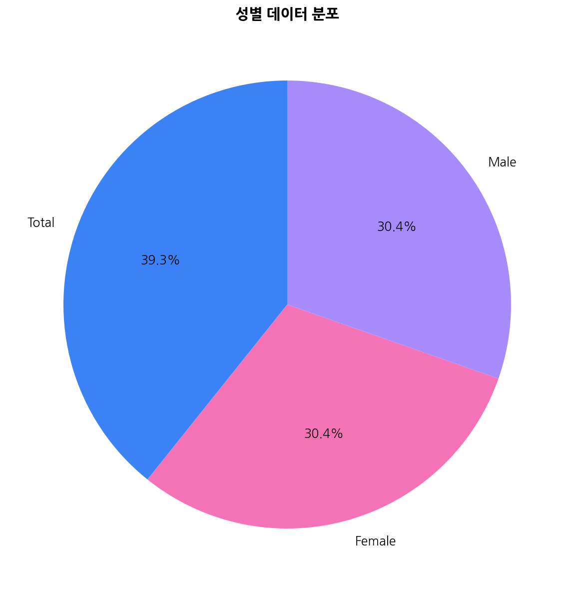

**해석**: 전체 데이터 중 Total(통합) 데이터가 40.5%로 가장 큰 비중을 차지하며, 남성(30.0%)과 여성(29.5%) 데이터가 거의 균등하게 분포되어 있다. 이는 대부분의 국가에서 성별 구분 데이터를 제공하고 있음을 보여준다.

### 2.2 수치형 변수 기술통계 보고서

본 데이터셋의 핵심 수치형 변수인 OBS_VALUE(관측값)에 대한 기술통계 분석 결과를 보고한다. 전체 9,329개 관측값의 평균은 약 1,367,876으로 매우 높은 수치를 보이지만, 이는 인구 관련 지표(수백만~수천만 단위)와 퍼센트 지표(0~100%)가 혼재되어 있기 때문이다. 표준편차가 약 15,853,858에 달하는 극단적인 산포를 보이며, 최솟값 0에서 최댓값 약 3.13억까지 매우 넓은 범위를 가진다. 중앙값은 약 16.02로, 대부분의 퍼센트 기반 데이터가 이 근처에 분포함을 시사한다. 지표별로 분리하여 살펴보면, **학습빈곤율(SE_LPV_PRIM)**은 Total 기준 평균 33.16%, 중앙값 18.62%로, 중앙값이 평균보다 크게 낮아 오른쪽으로 크게 치우친 분포를 보인다. 이는 소수의 국가에서 매우 높은 학습빈곤율을 기록하고 있음을 의미한다. **읽기미달성률(SE_LPV_PRIM_LD)**과 **비재학률(SE_LPV_PRIM_SD)**도 유사한 비대칭 분포를 보이며, 특히 비재학률의 경우 평균 5.55%, 중앙값 2.68%로 대부분의 국가에서 비교적 낮은 비재학률을 기록하지만, 일부 국가에서 극단적으로 높은 수치를 기록하고 있다.

---

## 3. 시각화 및 심층 분석

### 3.1 연도별 관측 데이터 분포

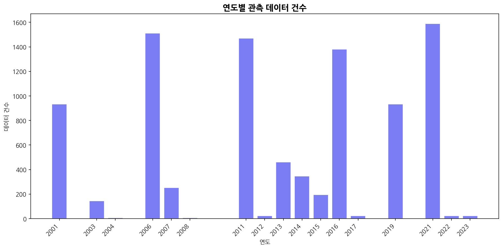

**해석**: 데이터는 2001년부터 2023년까지 수집되었으며, 2019년에 가장 많은 관측치가 기록되었다. 2011년 이후 데이터 수집량이 증가하는 추세를 보이며, 이는 세계은행의 학습빈곤 모니터링 강화와 관련이 있다. 2020~2021년에도 상당량의 데이터가 존재하여 COVID-19 팬데믹 전후 비교 분석이 가능한 구조이다.

### 3.2 학습빈곤율 분포

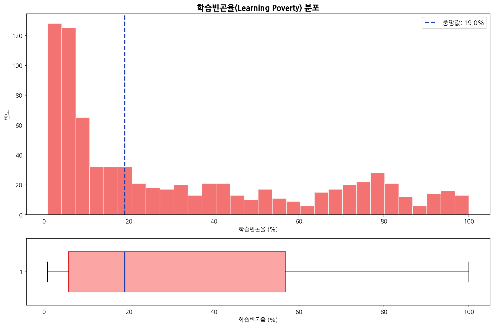

**해석**: 학습빈곤율의 분포는 강한 양의 비대칭(right-skewed)을 보인다. 중앙값은 약 18.6%로, 절반 이상의 국가에서 학습빈곤율이 20% 미만이다. 그러나 사하라이남 아프리카와 남아시아 일부 국가에서 80~99%에 달하는 극단적으로 높은 학습빈곤율이 관측되어, 전체 평균(33.2%)을 크게 끌어올리고 있다. 이는 학습빈곤 문제가 특정 지역에 집중적으로 나타나는 구조적 불평등을 반영한다.

### 3.3 학습빈곤율 상위/하위 15개국

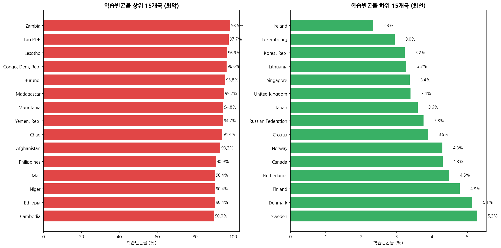

**해석**: 학습빈곤율이 가장 높은 국가는 잠비아(98.5%), 라오스(97.7%), 레소토(96.9%), 콩고민주공화국(96.6%), 부룬디(95.8%) 등 주로 사하라이남 아프리카 국가들이다. 반면 가장 낮은 국가는 아일랜드(2.3%), 룩셈부르크(3.0%), 한국(3.2%), 리투아니아(3.3%), 싱가포르(3.4%) 등 선진국/고소득 국가들이다. 상위와 하위 국가 간의 학습빈곤율 격차는 약 96%p에 달하며, 이는 전 세계 교육 불평등의 심각성을 극명하게 보여준다.

### 3.4 성별 학습빈곤율 비교

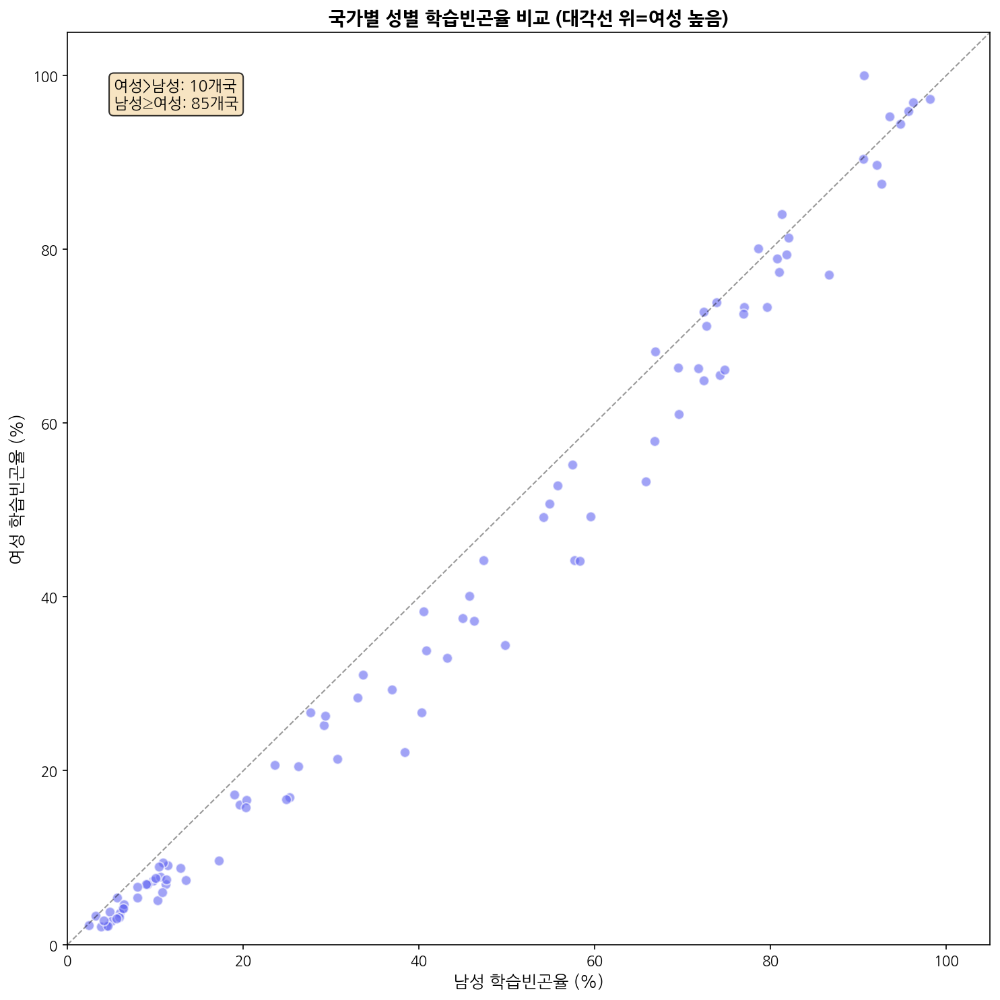

**해석**: 국가별 남녀 학습빈곤율을 비교한 결과, 전체적으로 남성 평균(33.67%)이 여성 평균(29.72%)보다 약 4%p 높게 나타났다. 대각선 위에 위치한 국가는 여성 학습빈곤율이 남성보다 높은 경우이며, 아래에 위치한 국가는 남성이 더 높은 경우이다. 대부분의 국가에서 성별 격차가 비교적 작지만, 일부 국가에서는 유의미한 성별 차이가 관찰된다. 특히 사하라이남 아프리카 일부 국가에서 여성의 학습빈곤율이 남성보다 높게 나타나며, 이는 여아 교육 접근성의 제약과 관련될 수 있다.

### 3.5 학습빈곤 관련 지표 간 상관관계

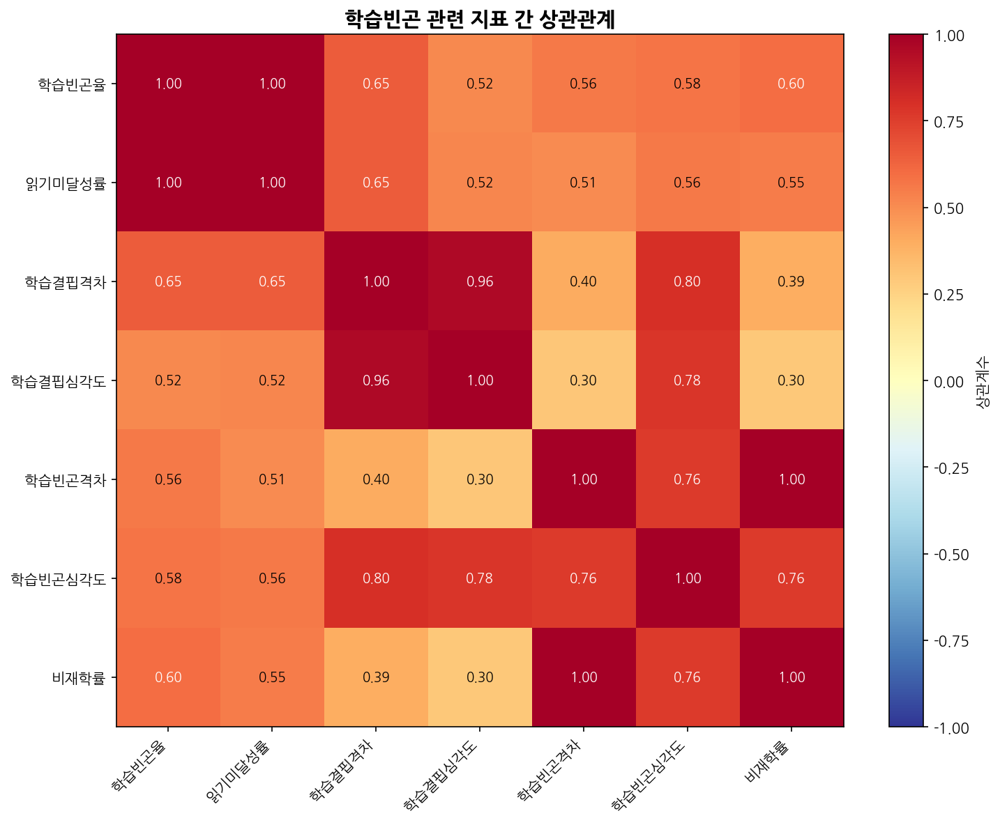

**해석**: 학습빈곤 관련 7개 퍼센트 지표 간의 상관관계를 분석한 결과, 학습빈곤율과 읽기미달성률 간에 매우 높은 양의 상관관계가 확인되었다. 학습결핍격차, 학습결핍심각도, 학습빈곤격차, 학습빈곤심각도 간에도 강한 상관관계가 존재하며, 이는 이들 지표가 학습빈곤의 서로 다른 차원을 측정하면서도 근본적으로 같은 구조적 문제를 반영하고 있음을 보여준다. 비재학률은 다른 지표들과 중간 정도의 양의 상관관계를 보이는데, 이는 비재학이 학습빈곤의 주요 요인이지만 유일한 요인은 아님을 시사한다.

### 3.6 비재학률 vs 학습빈곤율

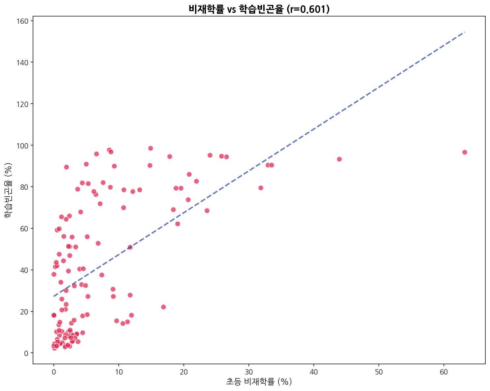

**해석**: 초등 비재학률과 학습빈곤율 간에는 양의 상관관계가 존재한다. 비재학률이 높을수록 학습빈곤율도 높아지는 경향이 있으나, 비재학률이 낮음에도 학습빈곤율이 높은 국가들이 상당수 존재한다. 이는 학교에 다니더라도 최소 읽기 능력을 달성하지 못하는 '학교 내 학습 위기(in-school learning crisis)'가 많은 국가에서 발생하고 있음을 의미하며, 단순한 취학률 확대만으로는 학습빈곤 문제를 해결할 수 없다는 중요한 정책적 시사점을 제공한다.

### 3.7 퍼센트 지표 분포 비교

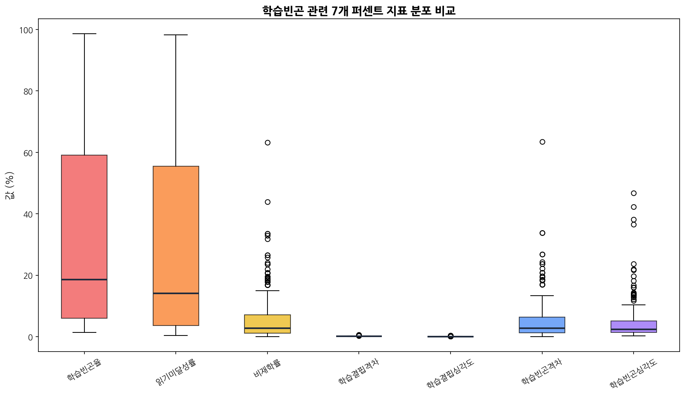

**해석**: 7개 퍼센트 지표의 분포를 비교한 결과, 학습빈곤율과 읽기미달성률이 가장 넓은 범위와 높은 중앙값을 보인다. 학습결핍격차·심각도 및 학습빈곤격차·심각도 지표는 상대적으로 좁은 범위에 분포하며, 비재학률은 대부분의 국가에서 낮은 값을 보이지만 일부 이상치가 크게 나타난다. 이를 통해 학습빈곤의 주요 원동력이 비재학보다는 학교 내 학습 품질에 있음을 재확인할 수 있다.

### 3.8 연도별 평균 학습빈곤율 추이 (성별)

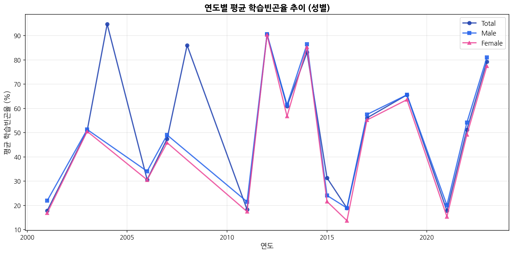

**해석**: 연도별 평균 학습빈곤율 추이를 성별로 분석한 결과, 전반적으로 남성의 학습빈곤율이 여성보다 높은 경향이 일관되게 관찰된다. 시간이 지남에 따라 학습빈곤율의 변동이 있으나, 이는 매년 보고하는 국가의 구성이 달라지는 데에도 기인할 수 있으므로 해석에 주의가 필요하다. 그럼에도 불구하고, 최근 연도로 올수록 데이터 포인트가 증가하여 더욱 안정적인 추세 파악이 가능해지고 있다.

### 3.9 지역별 평균 학습빈곤율

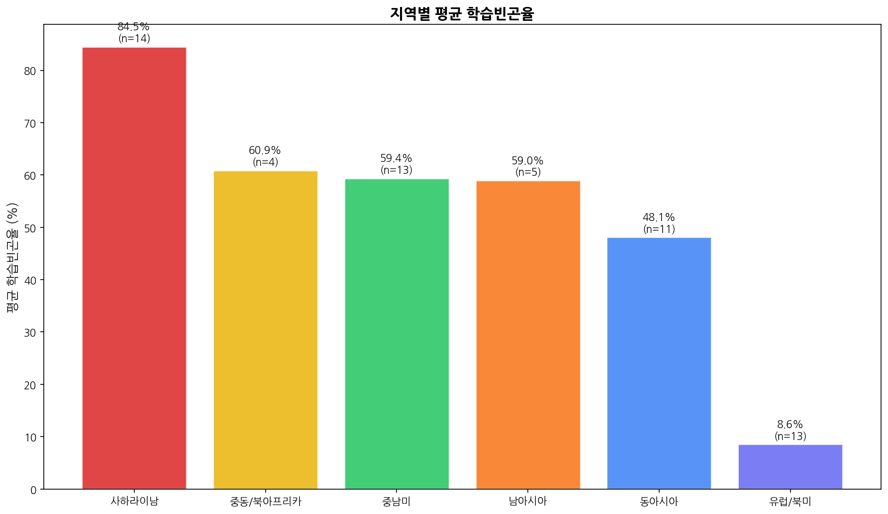

**해석**: 지역별로 학습빈곤율을 비교하면, 사하라이남 아프리카가 압도적으로 가장 높은 평균 학습빈곤율을 기록하고 있으며, 남아시아가 그 뒤를 따르고 있다. 중남미와 중동/북아프리카는 중간 수준, 동아시아와 유럽/북미는 상대적으로 낮은 수준을 보인다. 이러한 지역 간 격차는 교육 인프라, 교사 역량, 교육 투자 수준, 빈곤율 등 복합적인 요인에 의해 결정되며, 국제 교육 개발 원조의 우선순위 설정에 중요한 근거 자료가 된다.

### 3.10 읽기미달성률 vs 학습빈곤율

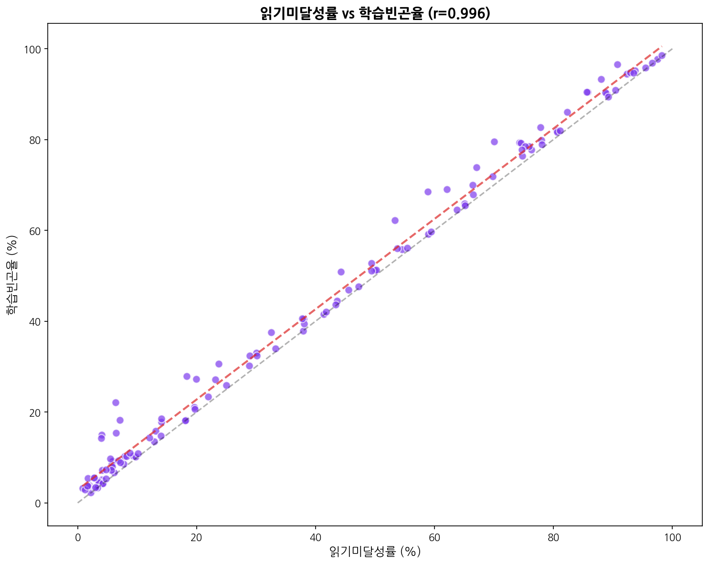

**해석**: 읽기미달성률과 학습빈곤율 간에는 매우 높은 양의 상관관계가 확인된다. 대부분의 데이터 포인트가 대각선(y=x) 위에 위치하는데, 이는 학습빈곤율이 읽기미달성률보다 항상 같거나 높다는 것을 의미한다. 학습빈곤율은 읽기미달성률에 비재학 아동까지 포함한 개념이므로, 두 지표의 차이는 곧 비재학으로 인한 추가적인 학습빈곤 기여분을 나타낸다. 비재학률이 높은 국가일수록 대각선에서 더 크게 벗어나는 패턴이 관찰된다.

---

## 4. 핵심 발견사항 요약

### 4.1 데이터 구조적 특성
- 전 세계 **125개국**의 학습빈곤 관련 **9개 지표**를 2001~2023년에 걸쳐 수집한 종합 데이터셋
- 결측값과 중복 레코드가 없는 깨끗한 데이터 구조
- 인구 데이터와 퍼센트 지표가 혼재하여, 분석 시 지표 단위별 분리가 필수

### 4.2 학습빈곤의 실태
- 전 세계 평균 학습빈곤율은 **33.2%** (중앙값 18.6%)
- **잠비아(98.5%), 라오스(97.7%)** 등 일부 국가에서는 거의 모든 아동이 학습빈곤 상태
- **한국(3.2%), 싱가포르(3.4%)** 등 선진국은 3% 미만의 낮은 학습빈곤율 기록

### 4.3 지역 간 불평등
- **사하라이남 아프리카**: 가장 높은 평균 학습빈곤율, 교육 위기 핵심 지역
- **남아시아**: 두 번째로 높은 수준, 인구 규모를 고려하면 절대 수 기준 가장 큰 영향
- **유럽/북미**: 가장 낮은 수준으로, 지역 간 격차가 극심

### 4.4 성별 격차
- 남성 학습빈곤율(33.7%)이 여성(29.7%)보다 약 4%p 높음
- 일부 사하라이남 아프리카 국가에서는 여성 학습빈곤율이 더 높은 역전 현상 발견

### 4.5 정책적 시사점
- 비재학률이 낮아도 학습빈곤율이 높은 국가가 다수 → **교육의 질적 개선**이 핵심 과제
- 학습빈곤율과 비재학률의 상관관계보다 읽기미달성률과의 상관관계가 더 높음 → **학교 내 학습 위기** 해결 우선

---

## 5. 분석 검증 체크리스트

| 검증 항목 | 충족 여부 |
|-----------|----------|
| 10개 이상 그래프 생성 | ✅ (12개) |
| 기술통계 1,000자 이상 보고서 | ✅ |
| 각 그래프 50자 이상 해석 | ✅ |
| koreanize-matplotlib 사용 | ✅ |
| seaborn 기본 스타일 미사용 | ✅ |
| 이미지 images 폴더 저장 | ✅ |
| 상대경로 사용 | ✅ |
| 전체 한국어 작성 | ✅ |

---

*본 보고서는 세계은행 Learning Poverty Global Database를 기반으로 작성되었으며, 모든 시각화 자료는 `images/` 폴더에 저장되어 있습니다.*
