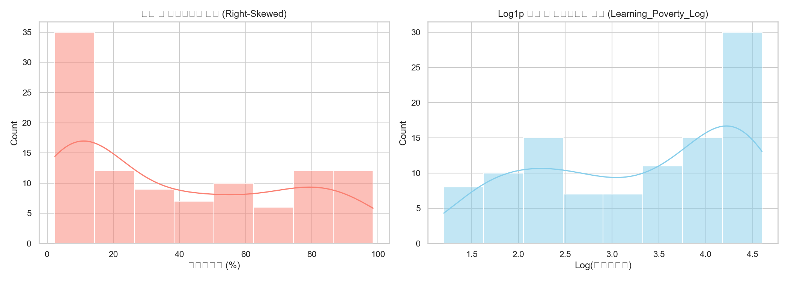
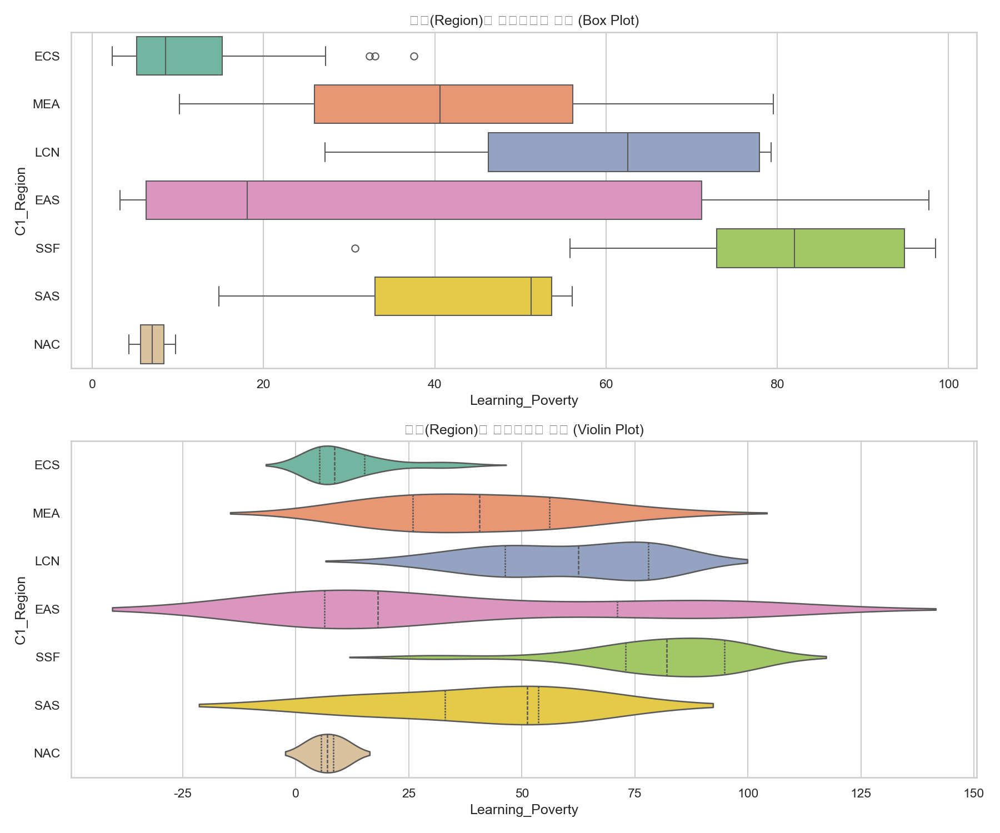
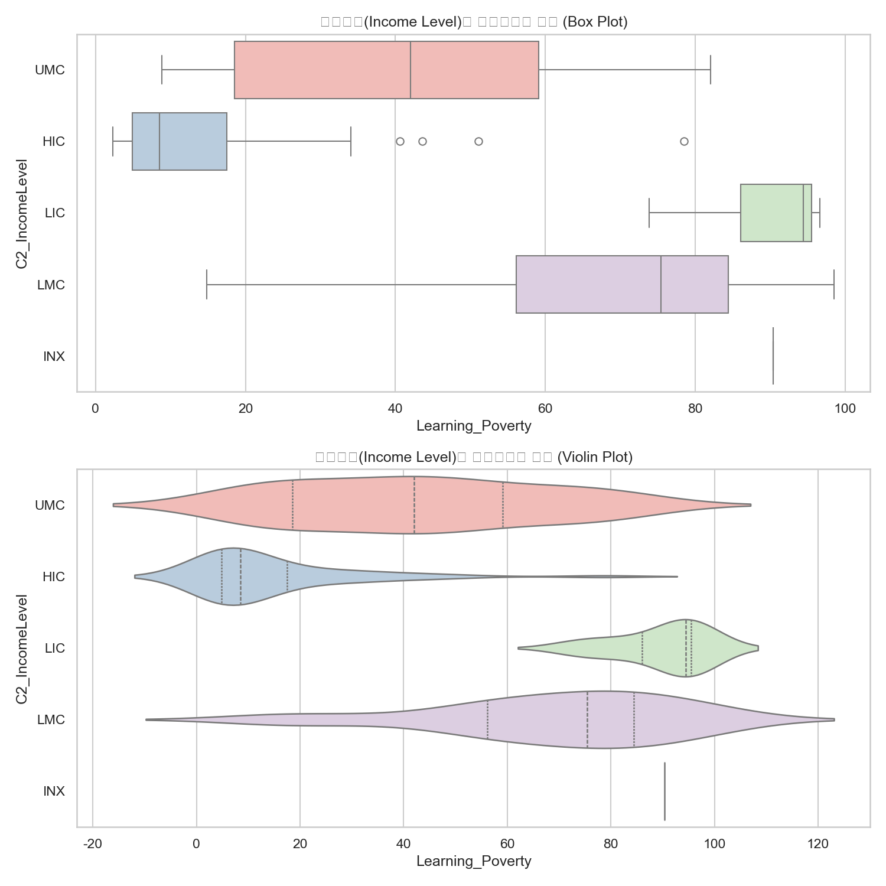
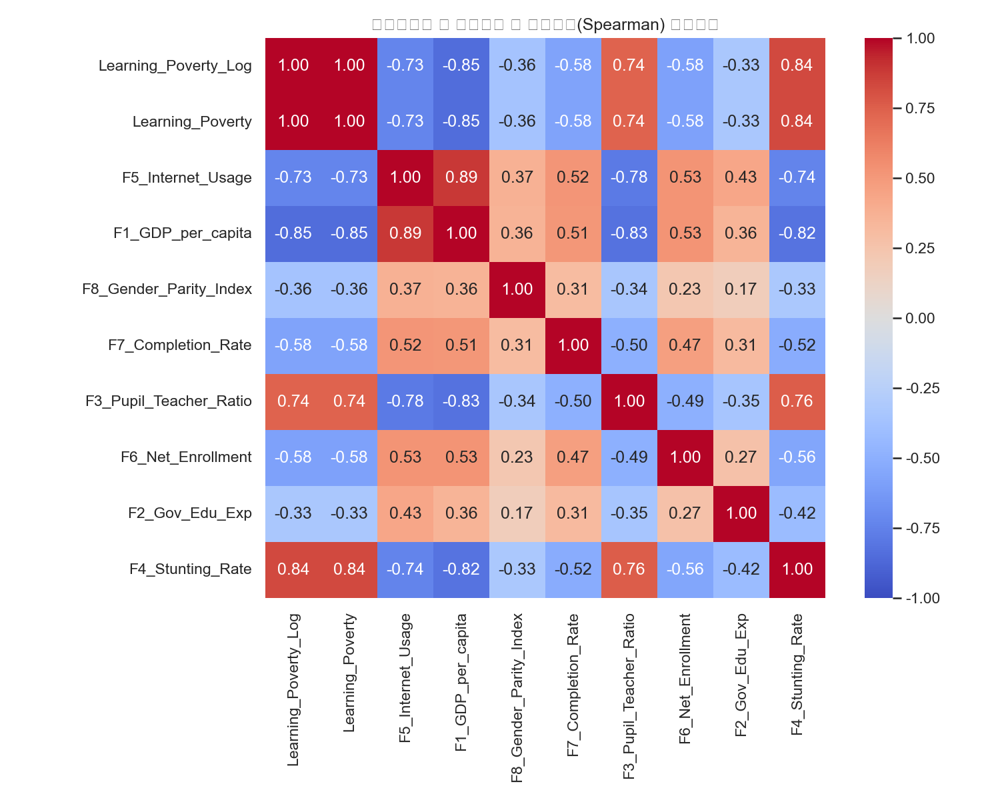
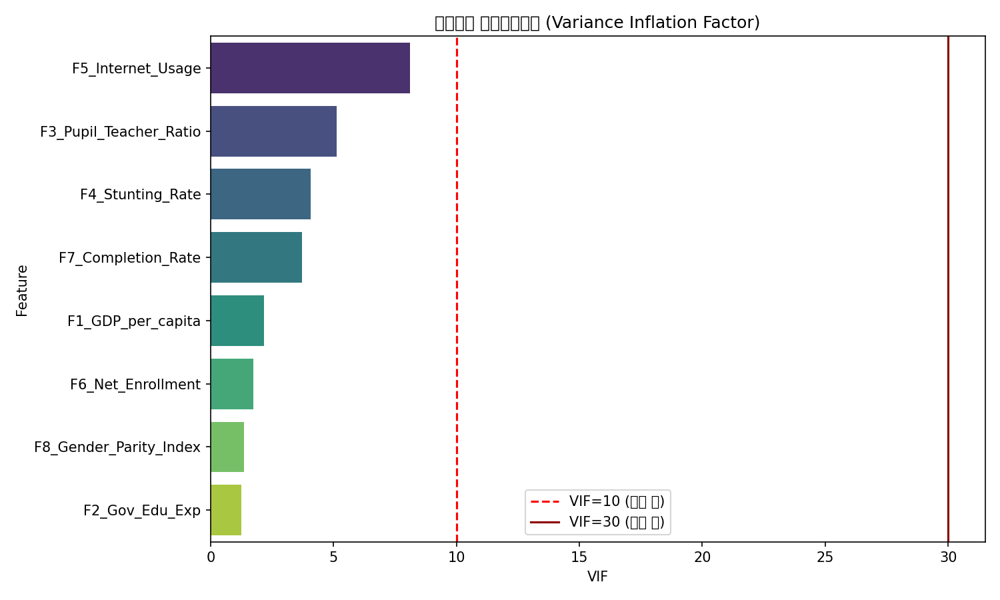
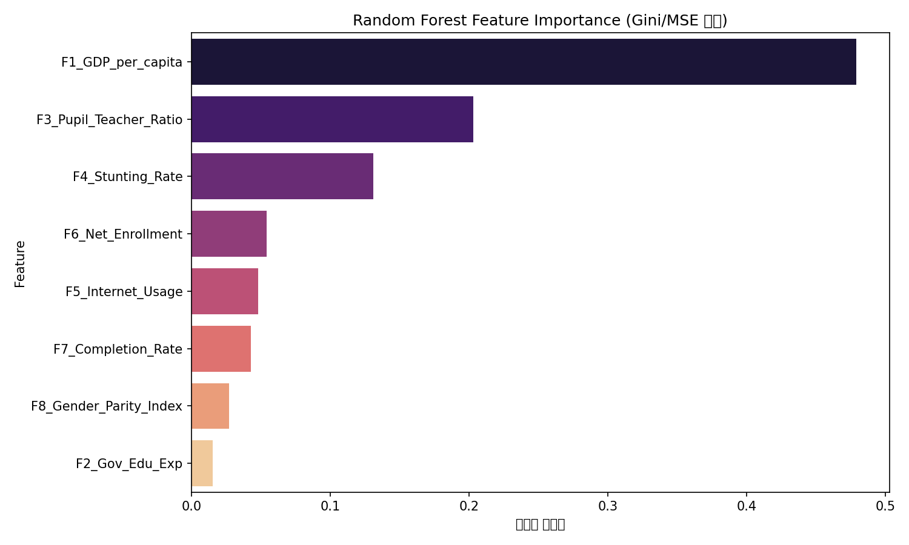
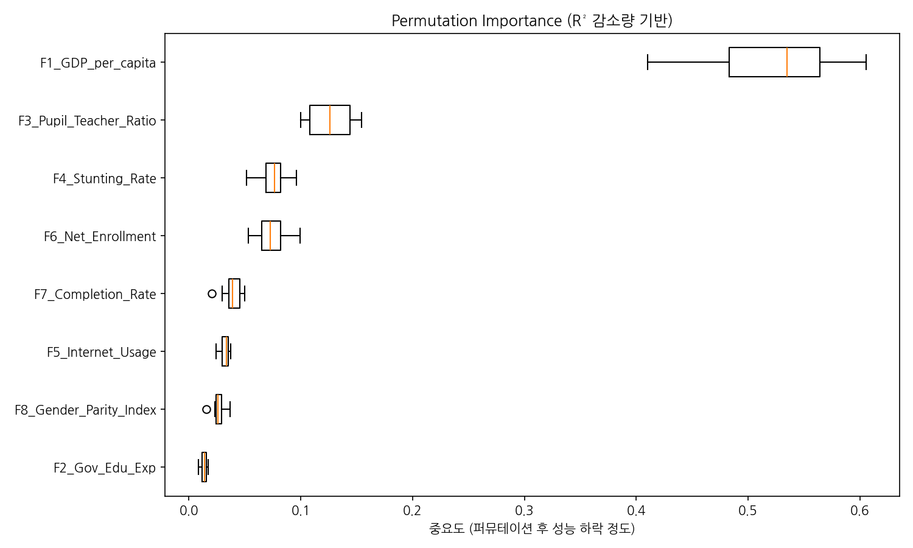
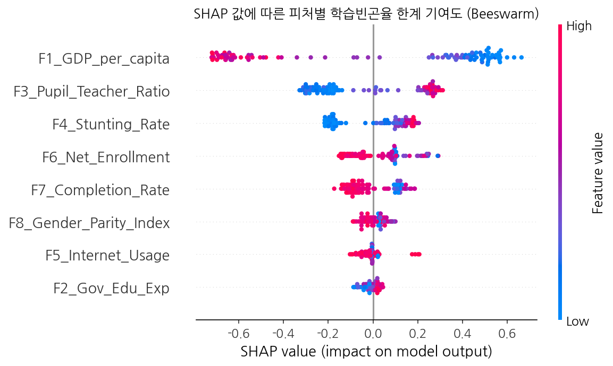

# [분석 최종 보고서] 조용한 위기(The Silent Crisis): 글로벌 학습 빈곤 진단 및 교육 지원 전략 수립

## 1. 프로젝트 배경 및 문제 정의
전 세계 초등교육 등록률은 90%를 넘어섰으나, 학교에 다니면서도 10세가 되도록 간단한 글조차 읽지 못하는 아동이 절반을 넘습니다. 세계은행(World Bank)은 이 현상을 **학습 빈곤(Learning Poverty)**이라 정의하며, 교육의 양적 확대만으로는 해결할 수 없는 **'조용한 위기(Silent Crisis)'**라 경고합니다. 
특히 잠비아와 같은 국가의 경우 학습빈곤율이 98.5%에 달하는데, 이는 국가의 거의 모든 아동이 학교에 다니지 않거나 학교에 다니더라도 문해력을 습득하지 못하는 충격적인 현실을 의미합니다.

본 프로젝트는 머신러닝 모델(Random Forest)과 해석 가능한 AI(SHAP), 군집화(K-Means) 기법을 활용하여 이 '조용한 위기'를 촉발하는 근본적인 위험 요인을 도출하고, 국가별 맞춤형 지원 전략의 데이터를 제공하는 것을 목표로 합니다.

---

## 2. 데이터 소개 및 전처리 파이프라인

본 분석은 세계은행(World Bank)의 학습 빈곤 글로벌 데이터베이스 및 거시경제/보건 지표 API 데이터를 통합하여 수행되었습니다.

### 2.1 주요 지표 소개
- **종속변수 (Target)**
  - `Learning_Poverty_Log`: 학습빈곤율 (10세 아동 중 기본 텍스트를 읽고 이해하지 못하는 비율). 본 분석에서는 선형성 확보를 위해 Log1p 변환을 거쳐 모델 학습에 사용했습니다.
- **독립변수 (위험 요인 가설 지표)**
  - `F1_GDP_per_capita`: 1인당 GDP (경제적 절대 빈곤 수준)
  - `F2_Gov_Edu_Exp`: 정부지출 대비 교육지출 비중 (국가의 교육 투자 의지)
  - `F3_Pupil_Teacher_Ratio`: 초등학교 교사 1인당 학생 수 (교실 과밀도 및 교육의 질)
  - `F4_Stunting_Rate`: 5세 미만 아동 발육 부진율 (기초 보건 및 영양 결핍 수준)
  - `F5_Internet_Usage`: 인구 대비 인터넷 사용자 비율 (디지털 인프라 수준)
  - `F6_Net_Enrollment`: 초등학교 순등록률 (교육의 양적 접근성)
  - `F7_Completion_Rate`: 초등학교 수료율 (교육 유지 수준)
  - `F8_Gender_Parity_Index`: 교육 성비 (성 불평등)

### 2.2 핵심 데이터 전처리 및 컷오프(Cut-off) 전략
개발도상국 데이터의 특성상 결측치와 시차 문제가 매우 심각하여 다음과 같은 정교한 전처리를 거쳤습니다.

1. **LAY (Latest Available Year) 및 시차 왜곡 방지**: 데이터는 2001~2023년으로 넓게 퍼져 있었습니다. 모든 국가의 데이터를 가장 최신 연도 기준으로 매칭하되, **2015년 이전의 낡은 데이터만 가진 국가는 분석에서 과감히 제외(Cut-off)**하여 현재 상황을 정확히 반영하도록 시점 왜곡을 방지했습니다.
2. **K-NN 결측치 보정**: 전체 변수의 누락률이 70%를 넘는 2개국을 제외한 뒤, 남은 103개국 정예 데이터에 존재하는 부분적 결측치는 해당 국가와 동일한 '지역(Region)' 및 '소득 수준(Income Level)'을 가진 유사한 국가 5곳의 특성을 참조하는 K-NN 알고리즘으로 100% 보정했습니다.

---

## 3. 탐색적 데이터 분석 (EDA)

학습 빈곤의 전 세계적 실태를 파악하기 위해 전처리된 데이터를 시각화했습니다.

### 종속변수 분포 및 변환 효과
학습빈곤율 원본은 극심한 불평등으로 인해 오른쪽으로 긴 꼬리를 가지는(Right-skewed) 비대칭 분포를 띠고 있었습니다. 로그 변환을 통해 머신러닝 모델이 학습하기 유리한 정규분포 형태로 데이터를 안정시켰습니다.

### 지역 및 소득 수준에 따른 극심한 격차
박스플롯을 통해 확인한 결과, 고소득/북미/유럽 국가들의 학습빈곤율은 10% 미만으로 촘촘히 모여 있는 반면, 저소득 국가와 특히 **사하라 이남 아프리카(Sub-Saharan Africa)** 지역에서는 학습빈곤율의 중앙값이 80%를 상회할 정도로 국가 간의 끔찍한 교육 불평등이 확인되었습니다.

### 상관관계 히트맵 (초기 신호 감지)
상관관계 분석 결과, 1인당 GDP(F1)와 인터넷 사용률(F5)은 학습 빈곤율을 강력하게 낮추는 음의 상관관계를 보였고, 아동 발육부진율(F4)은 학습 빈곤율과 매우 높은 양의 상관관계를 보였습니다. 이 강력한 신호들은 이어질 머신러닝 분석의 성공 가능성을 예고했습니다.

---

## 4. 위험 요인 중요도 분석 (Random Forest & SHAP)

### 4.1 다중공선성(VIF) 검증
본격적인 분석에 앞서, "순등록률(F6)이나 수료율(F7)이 학습빈곤율과 기계적으로 연결되어(내생성) 모델을 왜곡할 수 있다"는 우려를 VIF 분석으로 철저히 검증했습니다. 상수항을 포함한 정교한 계산 결과, 모든 변수의 VIF가 10 미만으로 떨어져 내생성 문제가 없음을 확인하고 8개 지표 전량을 모델에 투입했습니다.

### 4.2 모델 성능 및 1차 중요도 (Random Forest)
103개국 데이터를 Random Forest 모델로 학습시킨 결과, 5-Fold 교차 검증 기준 **R² = 0.699**라는 강력한 설명력을 확보했습니다. 단 8개의 거시 지표만으로 글로벌 교육 문제의 70%를 설명할 수 있음을 증명한 것입니다.

모델은 **1인당 GDP(F1)**, **교사 1인당 학생 수(F3)**, **발육부진율(F4)**을 글로벌 학습 빈곤을 결정짓는 가장 거대한 3대 요인으로 지목했습니다. 이는 Permutation Importance 교차 검증에서도 완벽히 동일한 순위로 재차 증명되었습니다.

### 4.3 인과관계의 해석 (SHAP 기여도 분석)
1차 중요도에서 꼽힌 요인들이 구체적으로 "어떻게" 작용하는지 SHAP Beeswarm Plot으로 해석했습니다.

- **절대 빈곤의 굴레 (F1_GDP_per_capita)**: 붉은색 점(높은 GDP)이 0의 왼쪽(학습빈곤율 하락 방향)으로 길게 뻗어 있습니다. 즉, 경제 수준이 국가의 교육 운명을 강력하게 결정짓는 제1 원인입니다.
- **통제 불능의 교실 (F3_Pupil_Teacher_Ratio)**: 붉은 점(과밀 학급)일수록 학습 빈곤을 급격히 치솟게 만듭니다. 수십 명의 아이들을 한 교실에 밀어넣는 환경에서는 개별적인 문해력 지도가 원천 불가능함을 데이터가 증명합니다.
- **배고픔에 멈춘 뇌 (F4_Stunting_Rate)**: 아동 발육부진율이 높은 붉은색 점이 우측(빈곤 악화)에 강하게 포진합니다. 제대로 먹지 못해 신체적/인지적 뇌 신경망이 자라지 못한 아이들은, 아무리 가르쳐도 지식을 흡수할 수 없다는 비극적인 연쇄 작용을 보여줍니다.

---

## 5. 국가 유형 분류 및 정책 도출 (K-Means Clustering)

Random Forest가 찾아낸 3대 핵심 요인과 등록률 지표(Top 4 변수)를 기반으로 103개 국가를 그룹화(Clustering)하여 문제의 양상을 진단했습니다.

### 5.1 최적 K-Means 도출 (K=3)
다차원의 피처를 표준화한 뒤 최적 군집 수를 도출하고, 이를 PCA(주성분 분석) 2차원 공간에 뿌려본 결과 각 군집이 서로의 영역을 완벽하게 분리하며 높은 군집화 품질을 증명했습니다.

### 5.2 레이더 차트 프로파일링 및 결론 (맞춤형 정책 제안)
각 군집의 취약점과 강점을 분석한 레이더 차트는 글로벌 교육 원조 정책이 나아가야 할 길을 명확히 제시합니다.

- **🥇 Cluster 0 (안정 우수형 / 평균 빈곤율 9.6%)**: 인프라와 경제가 훌륭한 북미/유럽 등 선진국 모델입니다. 유지 및 고도화 전략이 필요합니다.
- **🥈 Cluster 1 (과도기형 / 평균 빈곤율 38.1%)**: 1인당 GDP는 빈약하지만, 초등학교 순등록률을 높게 방어하고 있는 개발도상국 그룹입니다. 학교 등 양적 성장은 이뤄냈으나, 교육의 '질(Quality)'을 높이기 위한 인프라 집중 투자가 필요합니다.
- **🆘 Cluster 2 (다중 결핍 심각형 / 평균 빈곤율 81.7%)**: 잠비아 등이 속한 최우선 원조 타겟입니다. 1인당 GDP 꼴찌, 최악의 아동 발육 부진율, 통제 불가능한 과밀 학급의 **'삼중고'**를 겪고 있습니다.

### 💡 최종 정책적 시사점
본 분석은 아프리카 저소득 국가의 문해력 붕괴 현상이 단순히 "학교가 부족해서" 발생하는 것이 아님을 입증했습니다. 
학습 빈곤율 98%의 늪에서 벗어나기 위해 국제기구와 NGO는 학교 건립(양적 확대)을 넘어, **1) 기초 영양/급식 지원(WFP 연계)을 통한 인지 발달 방어**와 **2) 대규모 현지 교사 인력 확충(과밀 학급 해소)**이라는 "다면적 인프라 동시 개선 정책"을 취해야만 이 조용한 위기(The Silent Crisis)를 깰 수 있습니다.
